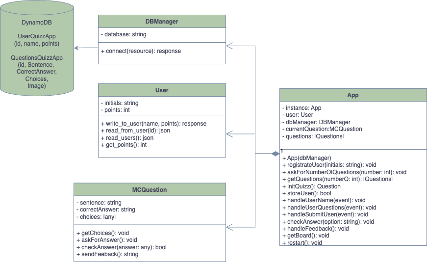

# Quiz Application with Microservices

## General overview
_A a quiz application that allows testing the user's knowledge about design patterns and refactorings_

## Diagram of the system and its constituent parts.


## Patterns used, and WHY those patterns were chosen. 
In terms of the design pattern used, we implemented the MVC (Model-View-Controller) pattern. We chose this pattern because it promotes a clear separation of responsibilities within an application.

**Model**: The model is responsible for handling data and logic. In our case, this functionality resides in the models files `UserModel.py` and `QuestionModel.py`. It interacts with the database and handles the necessary logic to process the received information.

**View**: The view is responsible for displaying the user interface and capturing user input. In our case, it is implemented in the React application (`Frontend/quizzapp`). Here, requests are made to the backend based on the operation or query to be performed. The response is then processed to fit each element within the React components.

**Controller**: The controller acts as an intermediary between the model and the view, controlling the flow of data and interactions. In this case, it is implemented in the `controller.py` file. We define the routes and validate the responses received from the controller.

This clear division of responsibilities facilitates code maintenance and modification since changes in one part of the pattern have minimal impact on the other parts.

Additionally, dividing an application into well-defined components allows us to reuse code in different projects. This promotes code reusability and saves development time.

Moreover, due to the separation of responsibilities, it is easier to test the different parts of the application in isolation, ensuring the reliability and quality of each component.

Lastly, we would like to highlight how following this model facilitated our collaborative work. We were able to work on different aspects of the application simultaneously without interfering with each other's work. The clear separation of concerns provided a smooth collaborative workflow.

🔗 Update the explanation of the diagram above to reflect the chosen patterns.

## Prerequisites
Before getting started, make sure you have the following requirements:

* An AWS account with permissions to perform operations on DynamoDB.
* The environment where you will deploy should have at least 2GB of memory.
* Git installed in the environment.
* Python 3 installed in the environment.
* Npm installed in the environment (Using nvm is recommended).
* Inbound and outbound connections enabled.

## Installation and Running the Application

The application is currently fully functional when used locally. Follow the instructions below to install it:

1. Clone this repository to your local environment and ensure that you meet the prerequisites.

### Backend Setup

2. Navigate to the "backend" folder.

3. Create a virtual environment to install Python dependencies.

```shell
python3 -m venv venv
```

4. Activate the virtual environment.

```shell
source venv/bin/activate
```

5. Install the necessary dependencies for the project within the virtual environment. These dependencies are listed in the "requirements.txt" file.

```shell
pip install -r requirements.txt
```

6. Create a "config.py" file and enter the following AWS credentials for the DynamoDB environment you will be using:

```python
AWS_ACCESS_KEY_ID = "your_access_key_id"
AWS_SECRET_ACCESS_KEY = "your_secret_access_key"
AWS_SESSION_TOKEN = "your_session_token"
REGION_NAME = "region_name"
```

7. Run the script using the following command:

```shell
python app.py
```

8. Access the '/create' route in your browser to create the necessary tables in DynamoDB.

9. Access the DynamoDB service from AWS and manually insert the "pool of questions" found in the 'poolQuestions.py' file.

Done! The backend configuration is ready.

### Frontend Setup

10. Navigate to the "Frontend/quizzapp" folder.

11. Set up npm using the command:

```shell
npm install
```

12. Create a .env and enter the REACT_APP_BACKEND_URL where the frontend will be doing the requests

```env
REACT_APP_BACKEND_URL=http://backend-host:backend-port
```

13. Run the application with the following command:

```shell
npm start
```

Done! The frontend configuration is ready. You can now use the app.

**Note:** Remember that these steps are for setting up the project locally, and it's necessary for both the backend and frontend to be located in the same place.

🚀🎉 Enjoy your experience with the application!


## Acknowledgments and References

### Deployment in Different Locations

This project is designed to be deployed in different locations, allowing the backend and frontend to be in separate instances. Only the frontend would need to be modified to update the API endpoint if necessary.

If you decide to deploy the backend and frontend in different locations, follow these steps:

1. Deploy the backend in the desired location, making sure to configure the necessary credentials for the AWS environment.

2. In the frontend code, uppdate the API endpoint to the new location where the backend is deployed. Replace the existing endpoint with the new URL or hostname.

By following these steps, you can successfully deploy the backend and frontend in different locations, ensuring they communicate with each other correctly 😊.